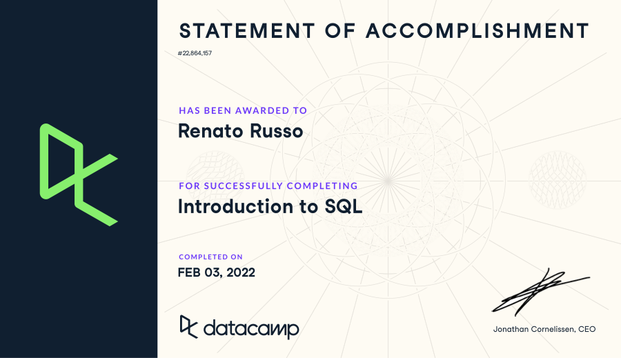

This is a notebook that documents my first Individual Coding Exercise. This is the first time ever that I experiment with databases, so I expect some bumps, but I'm OK with it.

# Part 1
I start  with [this blog post](https://www.pluralsight.com/blog/software-development/relational-vs-non-relational-databases) comparing relational and non-relational databases. By reading it, I have the impression that the learning curve will be less steep with relational DB, so I choose to work with this type of databases.

# Part 2: "Intro to SQL" DataCamp course
Next, I gave [this introductory DataCamp course](https://www.datacamp.com/courses/introduction-to-sql) a try. It really feels like another programming language, and the first few steps are quite intuitive.

- Indeed, the **first chapter** went smoothly, and I managed to learn a few basic commands such as `SELECT`, `COUNT`, and `DISTINCT`.
- **Chapter 2** starts off with the initially counter intuitive `WHERE`.The concept of "wildcards" is quite interesting, plus the name is intriguing ;-)
- **Chapter 3** introduces the aggregate functions, which I believe can come in handy in data analyses like those with which I'm used.
- Another syntax trick appears in **Chapter 4**: the use of `ORDER BY` coming after `FROM`

{width=90%}

In general, undertaking this first part of the assignment was easy, although I feel I made a mistake in terms of my learning: because I had a chunk of time available and was eager to understand the basics of SQL, I took the whole DataCamp course all at once, instead of practicing a consistently across a few days. I tend to prefer the latter approach, because I feel I consolidate knowledge better that way. Let's wait and see.

# Part 3: creating and writing to an AWS Database
Following the instructions in [this tutorial](https://www.youtube.com/watch?v=JnADtoprFMM), it was easy to create the database, although it seems that every step is a little risky, because the interface and set up feel a little "black-box-y."


```{r}
# Loading the libraries needed to manage the DB in R
library(DBI)
library(RMySQL)

# Storing credentials in variables
host <- "database-2.cluster-chhrqrpvglpz.us-east-1.rds.amazonaws.com"
port <- 3306
dbname <- "hudk4051"
user <- "renatorusso"
```
```{r, echo=FALSE}
password <- ""
```
```{r}

# Connecting to the database
my_db <- dbConnect(MySQL(), user = user, password = password, dbname = dbname, host = host, port = port)

# The first time that I "call" the database, the following 3 lines return empty values, obviously
my_db
summary(my_db)
dbListTables(my_db)

#Loading data--for this exercise, I'm using data from Jolley et al (2021)[1] on beliefs in conspiracy theories. They made the results
# available through the [Open Science Framework](https://osf.io/7f3qc/)
ACBQ_data <- readxl::read_xlsx("ACBQ/Data_ACBQ.xlsx")

# Writing data to the DB using the DBI package. The line below is commented because I can't write the same file twice to the database using that
# function
# dbWriteTable(my_db,"ACBQ_data", ACBQ_data)

# Checking if the data has been written to the DB.
dbListTables(my_db)

# Read table in the 
head(dbReadTable(my_db, "ACBQ_data"))

# Selecting columns
dbGetQuery(my_db, "SELECT ACBQ1 FROM ACBQ_data WHERE gender = '1' LIMIT 10")

# Combining aggregate functions with WHERE
dbGetQuery(my_db, "SELECT ABCQ FROM ACBQ_data WHERE RealworldCT > 3 LIMIT 10")


# [1] Jolley, D., Douglas, K., M, Skipper,Y,Thomas, E., &Cookson, D.(2021). Measuring adolescents’ beliefs in conspiracy theories: Development and validation of the Adolescent Conspiracy Beliefs Questionnaire (ACBQ). British Journal of Developmental Psychology.

```


